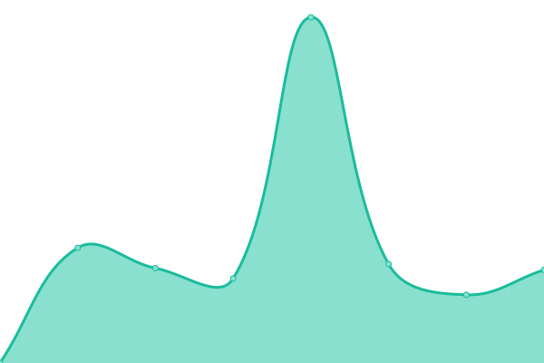

# [📈 Live Status](https://anandology.github.io/uptime): <!--live status--> **🟧 Partial outage**

This repository contains the open-source uptime monitor and status page for [Anand Chitipothu](http://anandology.com), powered by [Upptime](https://github.com/upptime/upptime).

With [Upptime](https://upptime.js.org), you can get your own unlimited and free uptime monitor and status page, powered entirely by a GitHub repository. We use [Issues](https://github.com/anandology/uptime/issues) as incident reports, [Actions](https://github.com/anandology/uptime/actions) as uptime monitors, and [Pages](https://anandology.github.io/uptime) for the status page.

<!--start: status pages-->
<!-- This summary is generated by Upptime (https://github.com/upptime/upptime) -->
<!-- Do not edit this manually, your changes will be overwritten -->
<!-- prettier-ignore -->
| URL | Status | History | Response Time | Uptime |
| --- | ------ | ------- | ------------- | ------ |
|  [Anandology](https://anandology.com/) | 🟩 Up | [anandology.yml](https://github.com/anandology/uptime/commits/HEAD/history/anandology.yml) | 

 957ms
     
 | 

<a href="https://anandology.github.io/uptime/history/anandology">100.00%</a>
    

|  [Pipal Academy](https://pipal.in) | 🟩 Up | [pipal-academy.yml](https://github.com/anandology/uptime/commits/HEAD/history/pipal-academy.yml) | 

 926ms
     
 | 

<a href="https://anandology.github.io/uptime/history/pipal-academy">100.00%</a>
    

|  [Cental Pollution Control Board - OCEMS Live Data](https://rtdms.cpcb.gov.in/api/industryList/45/39/Bangalore) | 🟥 Down | [cental-pollution-control-board-ocems-live-data.yml](https://github.com/anandology/uptime/commits/HEAD/history/cental-pollution-control-board-ocems-live-data.yml) | 

 2165ms
     
 | 

<a href="https://anandology.github.io/uptime/history/cental-pollution-control-board-ocems-live-data">0.00%</a>
    

<!--end: status pages-->

[**Visit our status website →**](https://anandology.github.io/uptime)

## 📄 License

- Powered by: [Upptime](https://github.com/upptime/upptime)
- Code: [MIT](./LICENSE) © [Anand Chowdhary](https://anandchowdhary.com), supported by [Pabio](https://pabio.com)
- Data in the `./history` directory: [Open Database License](https://opendatacommons.org/licenses/odbl/1-0/)
